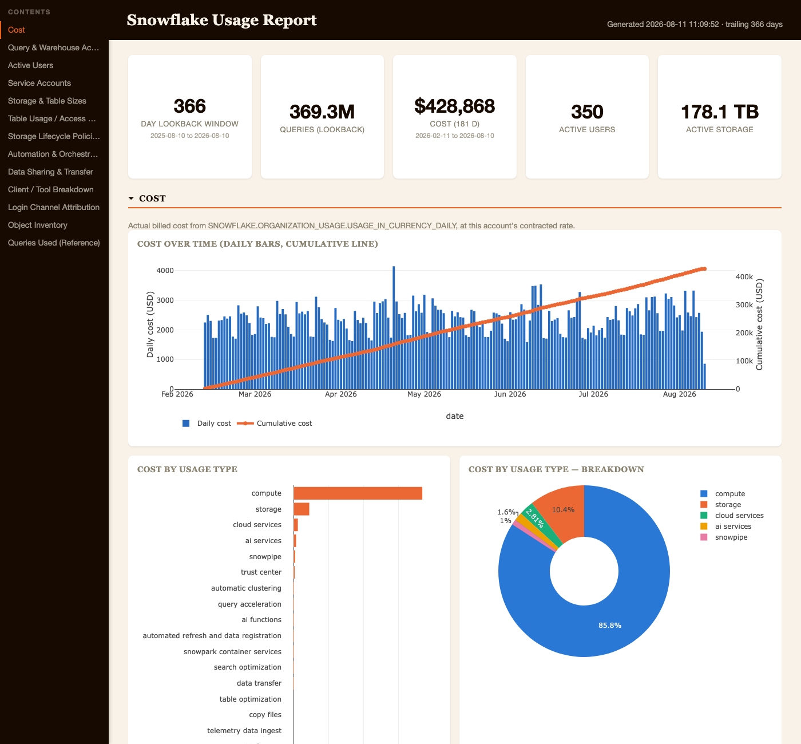
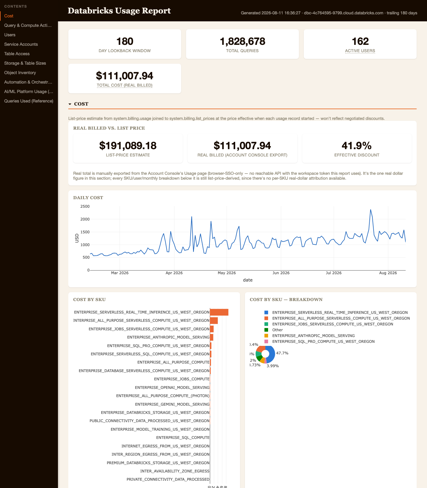
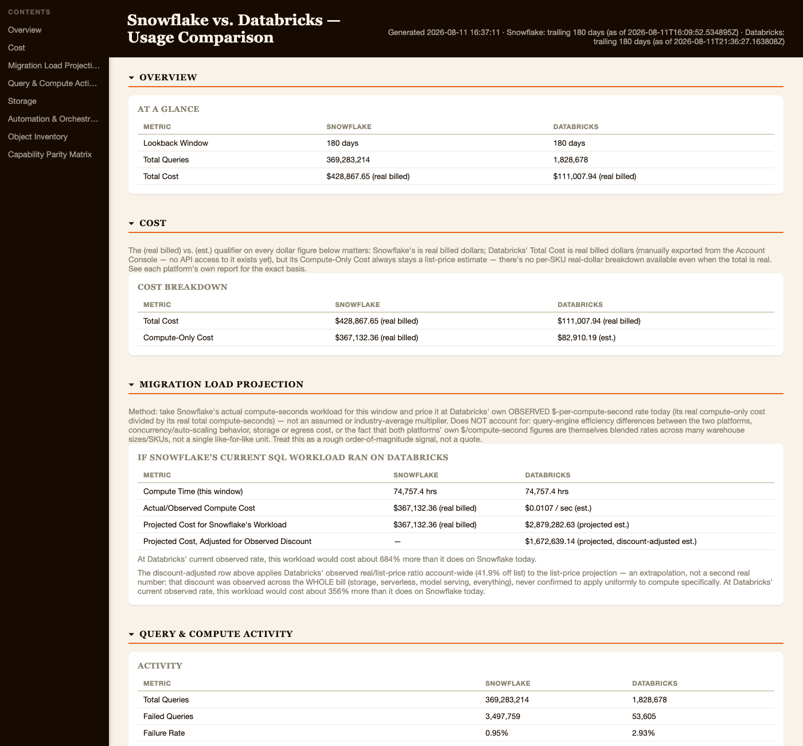

# Snowflake vs. Databricks Migration Scoping

Three local Spark/Scala tools, built to establish what's actually running on Snowflake today,
what's running on Databricks today, and how the two compare — ahead of scoping a Snowflake →
Databricks migration. Each generates a self-contained, offline HTML/Plotly report (no server, no
templating engine, no external JS) you open in a browser and can print straight to PDF.

> **Working on this repo with Claude Code?** See `CLAUDE.md` for engineering conventions, known
> gotchas, and current status — this README is the "what does it do and how do I run it" version.

| Phase | Package | Pulls from | Output |
|---|---|---|---|
| 1. Snowflake usage | `guild.snowflakeusage` | `SNOWFLAKE.ACCOUNT_USAGE` / `ORGANIZATION_USAGE` | `output/snowflake-usage-report.html` |
| 2. Databricks usage | `guild.databricksusage` | Unity Catalog System Tables | `output/databricks-usage-report.html` |
| 3. Comparison | `guild.comparison` | The two reports' own JSON summaries (no live connection) | `output/comparison-report.html` |

Run Phase 1 and Phase 2 independently, on whatever schedule suits each. Phase 3 reads the small
`output/{snowflake,databricks}-summary.json` files each of them writes and builds the side-by-side
comparison — it opens no database connection and starts no Spark session of its own.

## Example output

<table>
<tr><td width="33%">

**Snowflake usage report**
<a href="docs/screenshots/snowflake-report.png"></a>

</td><td width="33%">

**Databricks usage report**
<a href="docs/screenshots/databricks-report.png"></a>

</td><td width="33%">

**Comparison report**
<a href="docs/screenshots/comparison-report.png"></a>

</td></tr>
</table>

Each is a top-of-page crop (Overview + first section) of a real generated report — click through to
the repo copy for the full-size image. Every report is a single self-contained HTML file, so these
are just what opening one in a browser looks like, not a separate rendering path.

Screenshots go stale as sections change — regenerate them from a real, already-generated report with
headless Chrome rather than a manual screenshot tool, so they're reproducible:

```bash
CHROME="/Applications/Google Chrome.app/Contents/MacOS/Google Chrome"   # adjust for your OS/browser

"$CHROME" --headless --disable-gpu --hide-scrollbars --window-size=1400,1300 --virtual-time-budget=4000 \
  --screenshot=docs/screenshots/snowflake-report.png \
  "file://$(pwd)/output/snowflake-usage-report.html"

"$CHROME" --headless --disable-gpu --hide-scrollbars --window-size=1400,1600 --virtual-time-budget=6000 \
  --screenshot=docs/screenshots/databricks-report.png \
  "file://$(pwd)/output/databricks-usage-report.html"

"$CHROME" --headless --disable-gpu --hide-scrollbars --window-size=1400,1300 --virtual-time-budget=4000 \
  --screenshot=docs/screenshots/comparison-report.png \
  "file://$(pwd)/output/comparison-report.html"
```

`--virtual-time-budget` (milliseconds) matters — it's how long Chrome lets the page's JS run before
capturing, and Plotly's charts need a moment to draw; too short and you'll get blank chart areas.
`--window-size=W,H` sets the crop — taller captures more of the page but past a point on a long
report you'll want a section-specific crop instead of a single giant image (append `#dbxCostBody`,
`#cmpProjectionBody`, etc. — the real section anchor IDs from `toggleSection(...)` calls in the HTML
— to the URL to scroll near that section first, then trim the window height to match).

`docs/screenshots/` is deliberately **not** gitignored (unlike `data/`/`output/`) — these are meant
to be committed and visible on the repo's landing page.

## Prerequisites

- JDK 17 (Spark 3.5.1; `build.sbt` already sets the `--add-opens` flags JDK 17 needs)
- sbt 1.9+
- A Snowflake role with `SELECT` on `SNOWFLAKE.ACCOUNT_USAGE` (ideally also `ORGANIZATION_USAGE`,
  for real billed-dollar cost figures instead of a credit-price estimate)
- A Databricks personal access token with Unity Catalog System Tables enabled, and either
  `~/.databrickscfg` already configured (`databricks auth login`) or `--databricks-host`/`--databricks-token`

## Phase 1 — Snowflake usage report

SSO (default — opens a browser window to authenticate; complete the login promptly, it times out
after ~2 minutes):

```bash
sbt "runMain guild.snowflakeusage.UsageReportRunner --account xy12345.us-east-1 --user you@guild.com --role SNOWFLAKE_ANALYSTS --warehouse COMPUTE_WH --lookback-days 180"
```

Or set environment variables instead of flags (`SNOWFLAKE_ACCOUNT`, `SNOWFLAKE_USER`,
`SNOWFLAKE_ROLE`, `SNOWFLAKE_WAREHOUSE`, `LOOKBACK_DAYS`, ...) — see `Config.scala` for every flag's
matching env var.

### Useful flags

| Flag | Default | Purpose |
|---|---|---|
| `--lookback-days` | 90 | How much `ACCOUNT_USAGE` history to pull |
| `--cost-lookback-days` | same as `--lookback-days` | Billing history is cheap (one row/day/usage-type) — can span a full year independent of the activity lookback above |
| `--role` | `ACCOUNTADMIN` | Role to run queries as |
| `--authenticator` | `externalbrowser` | `externalbrowser` (SSO) or `snowflake` (username/password, needs `--password`) |
| `--output-path` | `output/snowflake-usage-report.html` | Where to write the report |
| `--cache-dir` | `data/raw` | Where pulled data is cached as Parquet |
| `--skip-fetch` | off | Rebuild the report from `--cache-dir` without querying Snowflake again |

`ACCOUNT_USAGE` views replicate with up to ~3 hours of latency and retain up to 365 days of
history — `--lookback-days` beyond that silently returns less data. `ACCESS_HISTORY` and a few
other views require **Enterprise Edition or higher**; if unavailable, the runner logs a warning and
skips that section rather than failing.

### What it pulls

Query & warehouse activity, active users (person vs. service, with daily active trend), storage &
table sizes (real, complete account-wide total via `TABLE_STORAGE_METRICS`), table access patterns
(most/least-queried tables — real migration-candidate signal), cost (real billed dollars via
`ORGANIZATION_USAGE.USAGE_IN_CURRENCY_DAILY` where accessible, credit-price estimate otherwise),
Tasks/Snowpipe/Streams/Materialized Views/Secure Data Sharing, service-account behavior, and a
client/tool + login-channel breakdown (which BI tools, ETL tools, and networks actually connect).

## Phase 2 — Databricks usage report

```bash
sbt "runMain guild.databricksusage.DatabricksUsageReportRunner --lookback-days 180"
```

Reads `host`/`token` straight from `~/.databrickscfg` by default — no flags needed if
`databricks auth login`/`databricks configure` has already been run. `--warehouse-id` auto-discovers
a running SQL warehouse if not given.

### Useful flags

| Flag | Default | Purpose |
|---|---|---|
| `--lookback-days` | 90 | How much system-table history to pull |
| `--warehouse-id` | auto-discovered | Pin explicitly if a newer system table (e.g. `system.data_quality_monitoring`) errors with a "Classic Compute" storage-access message |
| `--billable-usage-csv` | `data/manual/databricks-billable-usage.csv` | Optional real (not list-price) cost overlay — see below |
| `--cache-dir` | `data/raw-databricks` | Where pulled data is cached |
| `--skip-fetch` | off | Rebuild the report from `--cache-dir` without querying Databricks again |

### What it pulls

Overview & cost (list-price, from `system.billing.usage` × `system.billing.list_prices`), query/
compute activity, active users (person vs. service), storage (a **real, complete** account-wide
total via a parallelized `DESCRIBE DETAIL` sweep across every real table — not a sample), object
inventory, Jobs/Lakeflow automation, service-principal-resolved service accounts, and an "AI/ML
Platform Usage" section (MLflow, Model Serving, AI Gateway, Lakehouse Monitoring, Data
Classification) — genuinely Databricks-native capabilities with real usage numbers, not just
capability-matrix entries.

### Real billed dollars, not just list price

Databricks' system tables only expose list price — no negotiated-discount data is reachable via any
API with a workspace-scoped token. If your account has a negotiated rate, you can get the real
number from the Databricks **Account Console → Usage** page
(`https://accounts.cloud.databricks.com/usage/legacy?account_id=...` — requires account-admin
access, a separate auth path from the workspace token this tool otherwise uses). Export the CSV
(`timestamp,dbus,dollars`, one row per day) and drop it at `data/manual/databricks-billable-usage.csv`
— if present and it covers the report's date range, Total Cost becomes real ("real billed") instead
of a list-price estimate, both in this report and in the Phase 3 comparison. Compute-only cost
stays a list-price estimate either way (no per-SKU real breakdown exists). If the file's absent,
everything just falls back to list-price estimates as before — nothing else changes.

## Phase 3 — Comparison report

Run **after** both Phase 1 and Phase 2 have produced their summary JSON files, ideally with matching
`--lookback-days` on both sides (a mismatch triggers a loud warning, not a failure — every volume
metric is apples-to-oranges otherwise):

```bash
sbt "runMain guild.comparison.ComparisonReportRunner"
```

### What it builds

- Side-by-side Overview/Cost/Activity/Storage/Automation/Object-Inventory stats, each dollar figure
  labeled `(real billed)` or `(est.)` inline — never presented as more certain than it is.
- A **migration-load projection**: prices Snowflake's actual current compute-seconds workload at
  Databricks' own observed $/compute-second rate (both platforms' real current numbers, not an
  industry-average multiplier) — shown both at list price and, when a real cost overlay is
  available, adjusted for the observed real/list discount ratio (explicitly labeled as an
  extrapolation, since that discount is observed account-wide, not confirmed to apply uniformly to
  compute specifically).
- A hand-authored **capability-parity matrix** — Tasks↔Jobs, Snowpipe↔Auto Loader, Materialized
  Views↔DLT, Secure Data Sharing↔Delta Sharing, and genuinely Databricks-native rows (MLflow,
  Model Serving, AI Gateway, Lakehouse Monitoring) with real usage numbers, not just qualitative
  claims.

### Useful flags

| Flag | Default |
|---|---|
| `--snowflake-summary` | `output/snowflake-summary.json` |
| `--databricks-summary` | `output/databricks-summary.json` |
| `--output-path` | `output/comparison-report.html` |

## Architecture

```
guild.reportkit                  shared: PlatformSummary (+ JSON IO), HTMLUtil/PlotlyUtil/JSUtil
guild.snowflakeusage              Config, SnowflakeJdbc, queries/{Queries,Rows},
                                  aggregate/{Aggregates,Aggregations}, dashboard/UsageDashboard,
                                  UsageReportRunner (entry point)
guild.databricksusage             DatabricksConfig, DatabricksJdbc, ManualBillableUsage,
                                  queries/{Queries,Rows}, aggregate/{Aggregates,Aggregations},
                                  dashboard/DatabricksDashboard, DatabricksUsageReportRunner (entry point)
guild.comparison                  ComparisonAggregations, ComparisonDashboard,
                                  ComparisonReportRunner (entry point — no Spark session)
```

Every case class used as a Spark `Dataset[T]` element type is strongly typed end-to-end (no
dynamic `Row`/column-name access). Large system-table pulls (`system.access.audit`,
Snowflake's `QUERY_HISTORY`/`ACCESS_HISTORY`, both of which can run to hundreds of millions of rows
over a long lookback) are `GROUP BY`-aggregated in SQL before anything reaches Spark — never pulled
as raw rows. Each pull is cached (Parquet, or a small JSON file for single-row scalars) as it comes
in, so re-running a report after tweaking a chart doesn't require hitting the source platform
again — pass `--skip-fetch`.

Both `data/` and `output/` are gitignored — a fresh clone has no cached pulls and no generated
reports; run the fetches yourself.
